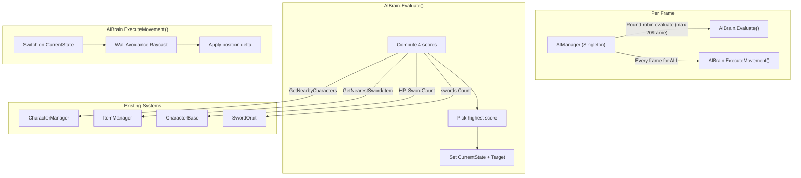
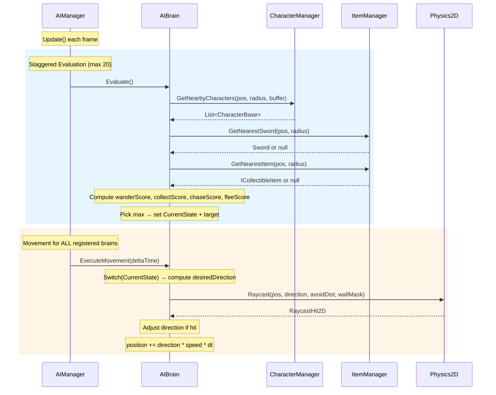

# Design Document: AI Brain State Machine

## Overview

This design describes a scoring-based AI state machine for a Unity 2D top-down sword-fighting game. The system enables up to 500 AI characters to make autonomous decisions across four behavioral states (Wander, Collect, Chase, Flee) while maintaining 60fps through staggered evaluation scheduling.

The architecture follows a centralized manager pattern consistent with the existing `CharacterManager` and `ItemManager` singletons. An `AIManager` singleton schedules decision-making evaluations in round-robin fashion (max 20 per frame), while an `AIBrain` component on each character computes per-state scores using spatial queries and selects the highest-scoring state. Movement executes every frame for all AI characters; only the scoring/decision logic is staggered.

Key design decisions:
- **Scoring over FSM transitions**: Instead of explicit transition rules between states, each state computes a score every evaluation. The highest score wins. This avoids combinatorial transition logic and makes adding new states trivial.
- **No per-state classes**: States are an enum, and behavior is handled via switch-based dispatch inside AIBrain. For 4 simple states this avoids class proliferation and virtual call overhead across 500 agents.
- **Reuse existing spatial infrastructure**: All queries go through `CharacterManager` and `ItemManager` spatial grids — no duplicate data structures.
- **Wall avoidance via raycasts**: Simple `Physics2D.Raycast` checks before applying movement, with direction adjustment. Runs every frame as part of movement, not during evaluation.

## Architecture

### High-Level Architecture



### Low-Level Data Flow



## Components and Interfaces

### New Files

| File | Location | Description |
|------|----------|-------------|
| `AIState.cs` | `Assets/_GAME/Scripts/AI/` | Enum with 4 states |
| `AIBrain.cs` | `Assets/_GAME/Scripts/AI/` | MonoBehaviour — scoring, state selection, movement |
| `AIManager.cs` | `Assets/_GAME/Scripts/Manager/` | Singleton — scheduling, batch movement |

### AIState Enum

```csharp
public enum AIState
{
    Wander = 0,
    Collect = 1,
    Chase = 2,
    Flee = 3
}
```

### AIBrain — Public Interface

```csharp
public class AIBrain : MonoBehaviour
{
    // ── Read-only properties ──
    public AIState CurrentState { get; }
    public Object CurrentTarget { get; }       // CharacterBase or ICollectibleItem
    public CharacterBase Owner { get; }

    // ── Called by AIManager ──
    public void Evaluate();                     // Scoring + state selection
    public void ExecuteMovement(float deltaTime); // Per-frame movement

    // ── Serialized tuning fields (Inspector) ──
    [SerializeField] float perceptionRadius = 10f;
    [SerializeField] float wanderChangeInterval = 2f;
    [SerializeField] float wallAvoidDistance = 1.5f;
    [SerializeField] LayerMask wallMask;
}
```

### AIManager — Public Interface

```csharp
public class AIManager : Singleton<AIManager>
{
    // ── Serialized tuning fields ──
    [SerializeField] int maxEvaluationsPerFrame = 20;
    [SerializeField] float evaluationInterval = 0.3f;

    // ── Registration ──
    public void Register(AIBrain brain);
    public void Deregister(AIBrain brain);

    // ── Properties ──
    public int BrainCount { get; }
}
```

### Integration Points

- **CharacterBase**: AIBrain reads `currentHp`, `maxHp`, `moveSpeed`, `Position`, and `GetSwordOrbit()`. AIBrain writes `transform.position` for movement. CharacterBase needs to expose `maxHp` and `currentHp` as read-only properties (currently private).
- **CharacterManager**: AIBrain calls `GetNearbyCharacters()` and `GetNearestCharacter()` during evaluation only.
- **ItemManager**: AIBrain calls `GetNearestSword()` and `GetNearestItem()` during evaluation only.
- **SwordOrbit**: AIBrain reads the sword count from the orbit to compare sword advantage.
- **Physics2D**: AIBrain calls `Physics2D.Raycast()` during movement for wall avoidance.

### Required Modifications to Existing Code

1. **CharacterBase** — Add public read-only accessors:
   ```csharp
   public float CurrentHp => currentHp;
   public float MaxHp => maxHp;
   public float MoveSpeed => moveSpeed;
   ```
2. **SwordOrbit** — Add sword count accessor:
   ```csharp
   public int SwordCount => swords.Count;
   ```

## Data Models

### AIBrain Internal State

```csharp
// ── State ──
private AIState currentState = AIState.Wander;
private CharacterBase chaseTarget;
private ICollectibleItem collectTarget;
private CharacterBase fleeTarget;

// ── Wander ──
private Vector2 wanderDirection;
private float wanderTimer;

// ── Scoring scratch (reused each evaluation, zero-alloc) ──
private readonly float[] scores = new float[4]; // indexed by AIState
private readonly List<CharacterBase> nearbyEnemies = new();

// ── Manager warning flag ──
private bool hasLoggedManagerWarning;
```

### AIManager Internal State

```csharp
// ── Brain list ──
private readonly List<AIBrain> brains = new();
private readonly List<AIBrain> pendingAdd = new();
private readonly List<AIBrain> pendingRemove = new();
private readonly HashSet<AIBrain> brainSet = new();
private bool isUpdating;

// ── Round-robin scheduling ──
private int roundRobinIndex;
```

### Scoring Functions (Pseudocode)

```
WanderScore():
    base = 0.5
    if nearbyEnemies.Count > 0: base -= 0.2
    if nearestItem != null: base -= 0.2
    return max(base, 0)

CollectScore():
    if nearestSword == null && nearestItem == null: return 0
    score = 0.3
    score += (maxSwords - currentSwords) * 0.15   // more need = higher score
    if nearestSword != null: score += 0.2
    return score

ChaseScore():
    bestScore = 0
    for each enemy in nearbyEnemies:
        if enemy.swordCount < owner.swordCount AND enemy.hp <= owner.hp:
            advantage = (owner.swordCount - enemy.swordCount) * 0.2
            advantage += (owner.hp - enemy.hp) / owner.maxHp * 0.3
            bestScore = max(bestScore, 0.3 + advantage)
    return bestScore

FleeScore():
    bestThreat = 0
    for each enemy in nearbyEnemies:
        if enemy.swordCount > owner.swordCount OR enemy.hp > owner.hp:
            threat = (enemy.swordCount - owner.swordCount) * 0.2
            threat += (enemy.hp - owner.hp) / owner.maxHp * 0.2
            bestThreat = max(bestThreat, threat)
    score = bestThreat
    if owner.hp / owner.maxHp < 0.3: score += 0.3  // low HP panic
    return score
```

### Wall Avoidance (Pseudocode)

```
AdjustForWalls(direction):
    hit = Physics2D.Raycast(position, direction, wallAvoidDistance, wallMask)
    if hit:
        // Try rotating ±45°, ±90° until clear
        for angle in [45, -45, 90, -90]:
            rotated = Rotate(direction, angle)
            if !Physics2D.Raycast(position, rotated, wallAvoidDistance, wallMask):
                return rotated
        return -direction  // fallback: reverse
    return direction
```


## Correctness Properties

*A property is a characteristic or behavior that should hold true across all valid executions of a system — essentially, a formal statement about what the system should do. Properties serve as the bridge between human-readable specifications and machine-verifiable correctness guarantees.*

### Property 1: Highest score wins

*For any* array of 4 float scores (one per AIState) where a unique maximum exists, the state selection function SHALL return the AIState whose index corresponds to the maximum score.

**Validates: Requirements 3.1, 3.2**

### Property 2: Tie-breaking preserves current state

*For any* array of 4 float scores where two or more states share the highest score, and the current state is among those tied states, the state selection function SHALL return the current state.

**Validates: Requirements 3.7**

### Property 3: Wander score decreases with nearby entities (metamorphic)

*For any* environment configuration, the wander score computed with zero nearby enemies and zero nearby items SHALL be greater than or equal to the wander score computed with the same configuration but with one or more nearby enemies or items added.

**Validates: Requirements 3.3**

### Property 4: Collect score monotonicity

*For any* two environment configurations that differ only in the number of nearby items (or the owner's sword count), the collect score SHALL be higher when more items are nearby or when the owner has fewer swords.

**Validates: Requirements 3.4**

### Property 5: Chase score increases with advantage

*For any* two environment configurations where the owner has a greater sword-count and HP advantage over the nearest enemy in configuration A than in configuration B, the chase score in A SHALL be greater than or equal to the chase score in B.

**Validates: Requirements 3.5**

### Property 6: Flee score increases with threat

*For any* two environment configurations where the nearest enemy has a greater sword-count and HP advantage over the owner in configuration A than in configuration B, the flee score in A SHALL be greater than or equal to the flee score in B. Additionally, *for any* configuration, the flee score when owner HP is below 30% of max SHALL be greater than the flee score with the same configuration but owner HP above 30%.

**Validates: Requirements 3.6**

### Property 7: Target-seeking movement direction

*For any* AIBrain in Collect or Chase state with a non-null target at position T and owner at position O (where O ≠ T), the computed movement direction SHALL have a positive dot product with the normalized vector (T - O).

**Validates: Requirements 4.2, 4.4**

### Property 8: Flee movement direction opposes threat

*For any* AIBrain in Flee state with a threat at position T and owner at position O (where O ≠ T), the computed movement direction SHALL have a negative dot product with the normalized vector (T - O).

**Validates: Requirements 4.6**

### Property 9: Movement magnitude invariant

*For any* AIBrain with moveSpeed S and deltaTime dt > 0, the position delta magnitude after one ExecuteMovement call SHALL equal S × dt (within floating-point tolerance). *For any* deltaTime dt ≤ 0, the position SHALL remain unchanged.

**Validates: Requirements 4.8, 10.5**

### Property 10: Wall avoidance produces safe direction

*For any* movement direction D and wall hit with normal N detected by raycast, the adjusted direction D' returned by wall avoidance SHALL satisfy dot(D', N) ≥ 0 (i.e., D' does not point into the wall).

**Validates: Requirements 5.2**

### Property 11: Evaluation cap per frame

*For any* number of registered AIBrains N ≥ 0, a single AIManager Update call SHALL invoke Evaluate on at most min(N, maxEvaluationsPerFrame) brains.

**Validates: Requirements 6.2**

### Property 12: Deregistration preserves relative order

*For any* list of registered AIBrains and any single brain removed, the remaining brains SHALL maintain their original relative order in the scheduling queue.

**Validates: Requirements 6.5**

### Property 13: Empty environment defaults to Wander

*For any* AIBrain evaluation where no enemies and no items are within the Perception_Radius, the selected state SHALL be Wander.

**Validates: Requirements 10.2**

## Error Handling

| Scenario | Handling |
|----------|----------|
| `CharacterManager.Instance` is null | AIBrain defaults to Wander, logs warning once via `hasLoggedManagerWarning` flag |
| `ItemManager.Instance` is null | AIBrain defaults to Wander, logs warning once |
| Chase/Collect target becomes null mid-frame | `ExecuteMovement` detects null target, triggers immediate re-evaluation |
| Target enemy moves out of perception radius | Next scheduled evaluation will not find the enemy, scores will shift to Wander/Collect |
| Collect target despawned | `ExecuteMovement` detects null/inactive target, triggers re-evaluation |
| `deltaTime` ≤ 0 | `ExecuteMovement` returns immediately, no position change |
| AIBrain's CharacterBase destroyed | `OnDisable`/`OnDestroy` deregisters from AIManager |
| AIManager has 0 brains | Update loop body is skipped (for-loop with count 0) |
| All raycast directions blocked by walls | Wall avoidance falls back to reversing direction (`-direction`) |
| Register/Deregister during AIManager Update | Deferred to pending lists, flushed next frame (same pattern as CharacterManager) |

## Testing Strategy

### Unit Tests (Example-Based)

Unit tests cover specific scenarios, edge cases, and integration wiring:

- **AIState enum**: Verify 4 values with correct names and integer backing (Req 1.1, 1.2)
- **AIBrain initialization**: Verify default state is Wander (Req 2.4)
- **Registration lifecycle**: Enable → registered, Disable → deregistered (Req 2.2, 2.3)
- **Null target re-evaluation**: Set target to null, verify state re-evaluates (Req 10.1)
- **Null manager fallback**: Null CharacterManager/ItemManager → Wander + warning (Req 9.4)
- **Wander direction change**: Advance past interval, verify direction changed (Req 4.1)
- **Deferred registration**: Register during update, verify deferred (Req 6.7)
- **Zero brains update**: AIManager Update with empty list, no errors (Req 10.4)
- **Movement doesn't re-evaluate**: ExecuteMovement with valid target, state unchanged (Req 7.3)

### Property-Based Tests

Property-based tests use [FsCheck](https://github.com/fscheck/FsCheck) (C# via NuGet) or a lightweight custom generator approach for Unity compatibility. Each test runs a minimum of 100 iterations.

| Property | Test Description | Tag |
|----------|-----------------|-----|
| 1 | Generate random float[4] scores, verify argmax selection | `Feature: ai-brain-state-machine, Property 1: Highest score wins` |
| 2 | Generate random float[4] with forced ties, verify current state preserved | `Feature: ai-brain-state-machine, Property 2: Tie-breaking preserves current state` |
| 3 | Generate random env, compare wander score with/without entities | `Feature: ai-brain-state-machine, Property 3: Wander score decreases with nearby entities` |
| 4 | Generate random item counts and sword counts, verify monotonicity | `Feature: ai-brain-state-machine, Property 4: Collect score monotonicity` |
| 5 | Generate random own/enemy stats, verify chase score ordering | `Feature: ai-brain-state-machine, Property 5: Chase score increases with advantage` |
| 6 | Generate random own/enemy stats + HP thresholds, verify flee score ordering | `Feature: ai-brain-state-machine, Property 6: Flee score increases with threat` |
| 7 | Generate random positions for owner and target, verify dot product > 0 | `Feature: ai-brain-state-machine, Property 7: Target-seeking movement direction` |
| 8 | Generate random positions for owner and threat, verify dot product < 0 | `Feature: ai-brain-state-machine, Property 8: Flee movement direction opposes threat` |
| 9 | Generate random speed, deltaTime (positive and non-positive), verify magnitude | `Feature: ai-brain-state-machine, Property 9: Movement magnitude invariant` |
| 10 | Generate random direction and wall normal, verify adjusted direction safe | `Feature: ai-brain-state-machine, Property 10: Wall avoidance produces safe direction` |
| 11 | Generate random brain counts 0–500, verify eval cap | `Feature: ai-brain-state-machine, Property 11: Evaluation cap per frame` |
| 12 | Generate random brain lists, remove random element, verify order preserved | `Feature: ai-brain-state-machine, Property 12: Deregistration preserves relative order` |
| 13 | Generate random positions with empty perception radius, verify Wander | `Feature: ai-brain-state-machine, Property 13: Empty environment defaults to Wander` |

### Testing Approach for Unity

Since this is a Unity project, property-based tests should be structured as **Unity Test Framework** (Edit Mode tests) where possible. The scoring functions and state selection logic should be extracted as pure static methods to enable testing without MonoBehaviour lifecycle:

```csharp
// Testable pure functions extracted from AIBrain
public static class AIScoring
{
    public static float ComputeWanderScore(int nearbyEnemyCount, bool hasNearbyItem);
    public static float ComputeCollectScore(int nearbyItemCount, int ownSwordCount, bool hasSword);
    public static float ComputeChaseScore(int ownSwords, float ownHp, int enemySwords, float enemyHp, float maxHp);
    public static float ComputeFleeScore(int ownSwords, float ownHp, int enemySwords, float enemyHp, float maxHp);
    public static AIState SelectState(float[] scores, AIState currentState);
    public static Vector2 AdjustForWalls(Vector2 direction, Vector2 wallNormal);
}
```

This allows property tests to run in Edit Mode without instantiating GameObjects, keeping iteration fast (~100 runs in <1 second).
