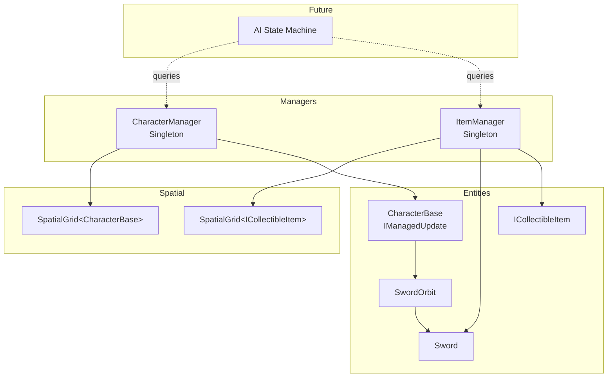
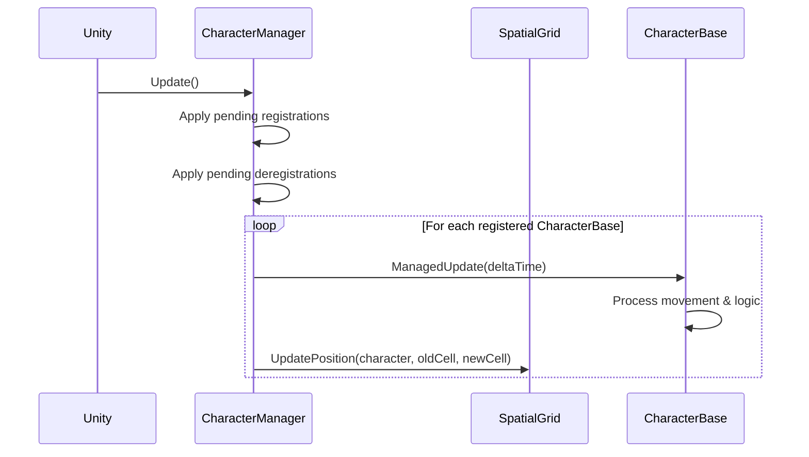
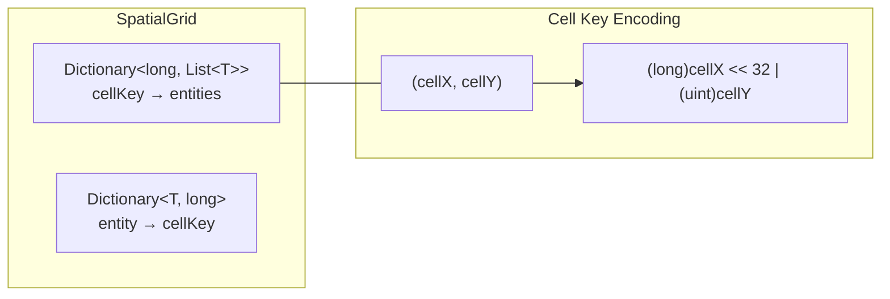

# Design Document: Character & Item Managers

## Overview

This design introduces two centralized singleton managers — `CharacterManager` and `ItemManager` — that replace per-entity `MonoBehaviour.Update()` calls with batch-update loops, provide spatial partitioning via a shared grid data structure, and expose query APIs for a future AI State Machine system.

The core performance insight: Unity's `MonoBehaviour.Update()` has significant per-call overhead from native→managed interop. With ~500 characters, centralizing updates into a single loop eliminates ~499 redundant interop crossings per frame. Combined with a spatial grid for O(1) cell lookups, the system can handle neighbor queries and item searches without linear scans.

### Key Design Decisions

1. **Shared `SpatialGrid<T>` generic class** — Both managers need identical spatial partitioning logic. A single generic implementation avoids duplication and ensures consistent behavior.
2. **Deferred registration buffer** — Registration/deregistration during iteration is handled via pending buffers applied after the loop, avoiding `InvalidOperationException` from collection modification.
3. **Virtual `Awake()` on Singleton** — The existing `Singleton<T>.Awake()` is `private`, preventing derived classes from running initialization. Changing it to `protected virtual` fixes this while maintaining the singleton pattern.
4. **Object pooling via `Stack<T>`** — Items are pooled using a simple stack. Pre-allocation at init, configurable max size, and destroy-on-overflow keep memory bounded.
5. **`IManagedUpdate` interface** — CharacterBase implements this interface so the manager calls `ManagedUpdate(float deltaTime)` instead of Unity calling `Update()`. This decouples the update mechanism from MonoBehaviour lifecycle.

## Architecture

### High-Level Architecture



### Update Flow (Per Frame)



### Low-Level Design: SpatialGrid Internals



The cell key packs two `int` coordinates into a single `long`, avoiding `Dictionary` overhead from struct keys or tuple hashing. World position `(x, y)` maps to cell `(Mathf.FloorToInt(x / cellSize), Mathf.FloorToInt(y / cellSize))`.

## Components and Interfaces

### `IManagedUpdate` Interface

```csharp
public interface IManagedUpdate
{
    void ManagedUpdate(float deltaTime);
    Vector3 Position { get; }
}
```

CharacterBase implements this. The `Position` property exposes `transform.position` so the manager can read positions without `GetComponent` calls.

### `ICollectibleItem` Interface

```csharp
public interface ICollectibleItem
{
    Vector3 Position { get; }
    bool IsActive { get; }
    GameObject GameObject { get; }
    CollectibleItemType ItemType { get; }
    void OnSpawn(Vector3 position);
    void OnDespawn();
}
```

Sword implements this interface for its `Dropped` state. Other future item types also implement it.

### `CollectibleItemType` Enum

```csharp
public enum CollectibleItemType
{
    Sword = 0,
    HealthPack = 1,
    SpeedBoost = 2
    // extensible for future item types
}
```

### `SpatialGrid<T>` Class

```csharp
public class SpatialGrid<T> where T : class
{
    // Constructor
    public SpatialGrid(float cellSize);

    // Core operations
    public void Add(T entity, Vector3 worldPosition);
    public void Remove(T entity);
    public void UpdatePosition(T entity, Vector3 newWorldPosition);
    public void Clear();

    // Queries — use shared List<T> buffer to avoid allocation
    public void GetInRadius(Vector3 center, float radius, List<T> results);
    public T GetNearest(Vector3 center, float radius, T exclude = null);
    public int Count { get; }
}
```

Internally:
- `Dictionary<long, List<T>> cells` — maps packed cell key to entity list
- `Dictionary<T, long> entityCells` — maps entity to its current cell key
- Cell lists are pooled: removed cells return their `List<T>` to a `Stack<List<T>>` for reuse
- `GetInRadius` computes the cell range `[minCellX..maxCellX, minCellY..maxCellY]` and iterates only those cells, performing distance-squared checks against each entity

### `CharacterManager` Class

```csharp
public class CharacterManager : Singleton<CharacterManager>
{
    [SerializeField] private float gridCellSize = 5f;
    [SerializeField] private bool persistAcrossScenes = false;

    // Internal state
    private SpatialGrid<CharacterBase> grid;
    private readonly List<CharacterBase> characters = new();
    private readonly List<CharacterBase> pendingAdd = new();
    private readonly List<CharacterBase> pendingRemove = new();
    private bool isUpdating = false;

    // Lifecycle
    protected override void Awake();
    private void Update();

    // Registration
    public void Register(CharacterBase character);
    public void Deregister(CharacterBase character);

    // Queries
    public int CharacterCount { get; }
    public void GetNearbyCharacters(Vector3 position, float radius, List<CharacterBase> results);
    public CharacterBase GetNearestCharacter(Vector3 position, float radius, CharacterBase excludeSelf = null);
    public void GetCharactersInRadius(Vector3 position, float radius, List<CharacterBase> results);
}
```

The `Update()` method:
1. Flushes `pendingAdd` → `characters` list + grid
2. Flushes `pendingRemove` → removes from `characters` list + grid
3. Sets `isUpdating = true`
4. Iterates `characters`, calls `ManagedUpdate(deltaTime)`, then `grid.UpdatePosition(character, character.Position)`
5. Sets `isUpdating = false`
6. (Any registrations during step 4 go to pending buffers)

### `ItemManager` Class

```csharp
public class ItemManager : Singleton<ItemManager>
{
    [SerializeField] private float gridCellSize = 5f;
    [SerializeField] private int poolInitialSize = 50;
    [SerializeField] private int poolMaxSize = 200;
    [SerializeField] private bool persistAcrossScenes = false;

    // Internal state
    private SpatialGrid<ICollectibleItem> grid;
    private readonly HashSet<ICollectibleItem> allItems = new();
    private readonly HashSet<Sword> droppedSwords = new();
    private readonly Dictionary<CollectibleItemType, Stack<GameObject>> pools = new();

    // Lifecycle
    protected override void Awake();

    // Registration
    public void RegisterItem(ICollectibleItem item);
    public void DeregisterItem(ICollectibleItem item);
    public void RegisterDroppedSword(Sword sword);
    public void DeregisterDroppedSword(Sword sword);

    // Spawning
    public GameObject SpawnItem(GameObject prefab, Vector3 position);
    public void DespawnItem(ICollectibleItem item);

    // Queries
    public void GetNearbyItems(Vector3 position, float radius, List<ICollectibleItem> results);
    public void GetNearbySwords(Vector3 position, float radius, List<Sword> results);
    public ICollectibleItem GetNearestItem(Vector3 position, float radius);
    public Sword GetNearestSword(Vector3 position, float radius);
    public ICollectibleItem GetNearestItemOfType(Vector3 position, float radius, CollectibleItemType itemType);
    public int ItemCount { get; }
    public int DroppedSwordCount { get; }
}
```

### Singleton Base Class Changes

```csharp
public class Singleton<T> : MonoBehaviour where T : MonoBehaviour
{
    private static T instance;

    public static T Instance
    {
        get
        {
            if (instance == null)
                instance = FindAnyObjectByType<T>();
            return instance;
        }
    }

    protected virtual void Awake()  // Changed from private to protected virtual
    {
        if (instance != null && instance != this)
        {
            Destroy(gameObject);
            return;
        }
        instance = this as T;
    }
}
```

### Integration Points with Existing Code

**CharacterBase changes:**
- Implements `IManagedUpdate`
- Moves movement/input logic from `Update()` to `ManagedUpdate(float deltaTime)`
- Adds `Position` property returning `transform.position`
- Calls `CharacterManager.Instance.Register(this)` in `Start()` / `OnEnable()`
- Calls `CharacterManager.Instance.Deregister(this)` in `OnDestroy()` / `OnDisable()`

**Sword changes:**
- Implements `ICollectibleItem`
- On state transition to `Dropped`: calls `ItemManager.Instance.RegisterDroppedSword(this)`
- On state transition from `Dropped` (pickup): calls `ItemManager.Instance.DeregisterDroppedSword(this)`

**GameManager changes:**
- No direct changes needed. CharacterManager and ItemManager are independent singletons.

## Data Models

### SpatialGrid Internal Data

| Field | Type | Purpose |
|-------|------|---------|
| `cellSize` | `float` | World-space size of each grid cell |
| `invCellSize` | `float` | `1f / cellSize`, cached to avoid division |
| `cells` | `Dictionary<long, List<T>>` | Cell key → list of entities in that cell |
| `entityCells` | `Dictionary<T, long>` | Entity → its current cell key |
| `listPool` | `Stack<List<T>>` | Recycled empty lists for removed cells |
| `count` | `int` | Total number of tracked entities |

### CharacterManager Internal Data

| Field | Type | Purpose |
|-------|------|---------|
| `grid` | `SpatialGrid<CharacterBase>` | Spatial partition for character queries |
| `characters` | `List<CharacterBase>` | Ordered list for batch iteration |
| `pendingAdd` | `List<CharacterBase>` | Buffer for registrations during update |
| `pendingRemove` | `List<CharacterBase>` | Buffer for deregistrations during update |
| `characterSet` | `HashSet<CharacterBase>` | O(1) duplicate/existence checks |
| `isUpdating` | `bool` | Guard flag for deferred operations |

### ItemManager Internal Data

| Field | Type | Purpose |
|-------|------|---------|
| `grid` | `SpatialGrid<ICollectibleItem>` | Spatial partition for item queries |
| `allItems` | `HashSet<ICollectibleItem>` | All registered collectible items |
| `droppedSwords` | `HashSet<Sword>` | Subset: only dropped swords |
| `pools` | `Dictionary<CollectibleItemType, Stack<GameObject>>` | Object pools per item type |
| `poolMaxSize` | `int` | Max pooled instances per type |

### Object Pool Per-Type Data

| Field | Type | Purpose |
|-------|------|---------|
| `stack` | `Stack<GameObject>` | Inactive pooled instances |
| `prefab` | `GameObject` | Template for new instantiations |
| `count` | `int` | Current pool size (for max enforcement) |


## Correctness Properties

*A property is a characteristic or behavior that should hold true across all valid executions of a system — essentially, a formal statement about what the system should do. Properties serve as the bridge between human-readable specifications and machine-verifiable correctness guarantees.*

### Property 1: Spatial grid add/remove correctness

*For any* entity added to a `SpatialGrid<T>` at a random world position, the entity SHALL be retrievable from the grid cell corresponding to `(FloorToInt(x / cellSize), FloorToInt(y / cellSize))`, and after removal, the entity SHALL no longer be present in any grid cell.

**Validates: Requirements 1.1, 1.2, 5.1, 5.2, 5.4**

### Property 2: Spatial grid position update correctness

*For any* entity in a `SpatialGrid<T>` that moves from position A to position B, after calling `UpdatePosition`, the entity SHALL be present only in the grid cell corresponding to position B and absent from the grid cell corresponding to position A (when A and B map to different cells).

**Validates: Requirements 2.2, 3.3**

### Property 3: Radius query matches brute-force scan

*For any* set of entities at random positions in a `SpatialGrid<T>`, and *for any* query center and radius, the set of entities returned by `GetInRadius` SHALL be identical to the set returned by a brute-force linear scan that checks `Vector3.Distance(entity.Position, center) <= radius` for every entity.

**Validates: Requirements 2.3, 2.4, 6.2**

### Property 4: Registration idempotence

*For any* `CharacterBase` instance, calling `Register` twice with the same instance SHALL result in exactly one entry in the registry and exactly one entry in the spatial grid. The `CharacterCount` SHALL increase by exactly 1 from the state before the first registration.

**Validates: Requirements 1.5**

### Property 5: Character count invariant

*For any* sequence of `Register` and `Deregister` operations on `CharacterManager`, the value of `CharacterCount` SHALL always equal the number of unique, currently-registered `CharacterBase` instances.

**Validates: Requirements 1.3, 4.3**

### Property 6: Nearest query correctness

*For any* set of entities at random positions, and *for any* query center, radius, and optional type filter, the entity returned by `GetNearest` / `GetNearestCharacter` / `GetNearestItem` / `GetNearestSword` / `GetNearestItemOfType` SHALL be the entity with the minimum distance to the query center among all entities matching the filter and within the radius, as computed by brute-force.

**Validates: Requirements 4.1, 6.4, 8.1, 8.2**

### Property 7: Sorted radius query ordering

*For any* set of characters at random positions, and *for any* query center and radius, the list returned by `GetCharactersInRadius` SHALL contain exactly the characters within the radius, and for every consecutive pair `(results[i], results[i+1])`, `Distance(results[i], center) <= Distance(results[i+1], center)`.

**Validates: Requirements 4.2**

### Property 8: Dropped sword tracking invariant

*For any* sequence of `RegisterItem`, `DeregisterItem`, `RegisterDroppedSword`, and `DeregisterDroppedSword` operations, `DroppedSwordCount` SHALL equal the number of currently-registered dropped swords, `ItemCount` SHALL equal the total number of currently-registered items, and the set of dropped swords SHALL be a subset of all registered items.

**Validates: Requirements 5.3, 8.3, 8.4**

### Property 9: Filtered sword query correctness

*For any* mix of dropped swords and other collectible items at random positions, and *for any* query center and radius, `GetNearbySwords` SHALL return only entities that are `Sword` instances in the `Dropped` state, and the returned set SHALL match a brute-force scan filtered to swords within the radius.

**Validates: Requirements 6.3**

### Property 10: Object pool bounded size

*For any* sequence of `SpawnItem` and `DespawnItem` operations, the number of inactive instances in the object pool for any given `CollectibleItemType` SHALL never exceed `poolMaxSize`. When a despawn would cause the pool to exceed `poolMaxSize`, the instance SHALL be destroyed instead of pooled.

**Validates: Requirements 7.4**

### Property 11: Spawn/despawn round-trip

*For any* item type, if `SpawnItem` is called N times and then `DespawnItem` is called on all N items, and then `SpawnItem` is called N times again, the second batch of spawns SHALL reuse pooled instances (up to pool capacity) rather than instantiating new ones, and all spawned items SHALL be placed at their specified positions and registered in the spatial grid.

**Validates: Requirements 7.1, 7.2**

## Error Handling

### Registration Errors

| Scenario | Behavior |
|----------|----------|
| Deregister unregistered character | Silently ignored (no exception) |
| Register already-registered character | Silently ignored (no duplicate) |
| Deregister unregistered item | Silently ignored (no exception) |
| Register/deregister during update loop | Deferred to pending buffer, applied after iteration |

### Query Errors

| Scenario | Behavior |
|----------|----------|
| No characters in radius (single) | Returns `null` |
| No characters in radius (multi) | Returns empty list (caller-provided, cleared) |
| No items in radius (single) | Returns `null` |
| No items in radius (multi) | Returns empty list (caller-provided, cleared) |
| Null `excludeSelf` parameter | Treated as no exclusion |

### Object Pool Errors

| Scenario | Behavior |
|----------|----------|
| Spawn with empty pool | Instantiate new instance |
| Despawn when pool at max capacity | Destroy instance instead of pooling |
| Despawn already-despawned item | Silently ignored |
| Null prefab passed to SpawnItem | Log warning, return null |

### Grid Errors

| Scenario | Behavior |
|----------|----------|
| UpdatePosition for untracked entity | Silently ignored |
| Remove untracked entity | Silently ignored |
| NaN or Infinity position | Clamp to large finite value, log warning |

## Testing Strategy

### Unit Tests (Example-Based)

Unit tests cover specific scenarios, integration points, and edge cases:

- **Batch update invocation**: Register N characters, trigger one manager update, verify `ManagedUpdate` called on all N with correct `deltaTime` (Requirements 3.1, 3.2)
- **Deferred registration during update**: Register a character during a `ManagedUpdate` callback, verify it appears after the loop completes (Requirement 3.4)
- **Singleton override**: Verify a derived singleton can override `Awake()` and still maintain the singleton pattern (Requirement 9.3)
- **Empty deregister**: Deregister an unregistered character/item, verify no exception (Requirements 1.4, 5.5)
- **Empty query results**: Query with no entities in range, verify null/empty returns (Requirements 2.5, 4.4, 6.5, 8.5)
- **Pool pre-allocation**: After initialization, verify pool contains configured number of instances (Requirement 7.3)
- **Scene persistence**: Verify `DontDestroyOnLoad` behavior based on `persistAcrossScenes` flag (Requirements 9.4, 9.5)

### Property-Based Tests

Property-based tests verify universal correctness properties using the [FsCheck](https://github.com/fscheck/FsCheck) library for C#/.NET, configured with a minimum of 100 iterations per property.

Each property test references its design document property:

| Property | Test Tag | What Varies |
|----------|----------|-------------|
| Property 1 | `Feature: character-item-managers, Property 1: Spatial grid add/remove correctness` | Entity positions, add/remove sequences |
| Property 2 | `Feature: character-item-managers, Property 2: Spatial grid position update correctness` | Start positions, end positions, cell boundaries |
| Property 3 | `Feature: character-item-managers, Property 3: Radius query matches brute-force scan` | Entity positions, query center, query radius |
| Property 4 | `Feature: character-item-managers, Property 4: Registration idempotence` | Character instances, positions |
| Property 5 | `Feature: character-item-managers, Property 5: Character count invariant` | Register/deregister operation sequences |
| Property 6 | `Feature: character-item-managers, Property 6: Nearest query correctness` | Entity positions, query center, radius, filters |
| Property 7 | `Feature: character-item-managers, Property 7: Sorted radius query ordering` | Character positions, query center, radius |
| Property 8 | `Feature: character-item-managers, Property 8: Dropped sword tracking invariant` | Mixed register/deregister sequences of swords and items |
| Property 9 | `Feature: character-item-managers, Property 9: Filtered sword query correctness` | Mixed item types, positions, query parameters |
| Property 10 | `Feature: character-item-managers, Property 10: Object pool bounded size` | Spawn/despawn sequences, pool max size |
| Property 11 | `Feature: character-item-managers, Property 11: Spawn/despawn round-trip` | Item types, positions, spawn counts |

### Testing Approach

The `SpatialGrid<T>` class is a pure data structure with no Unity dependencies beyond `Vector3`, making it ideal for property-based testing. Properties 1–3 and 6 can be tested entirely in isolation with mock entities that simply hold a `Vector3 Position`.

Manager-level properties (4, 5, 7–11) require lightweight mocks for `CharacterBase` and `ICollectibleItem` but can still run without a Unity scene by abstracting away `MonoBehaviour` lifecycle calls.

Property-based testing library: **FsCheck** (NuGet package `FsCheck` + `FsCheck.NUnit` or `FsCheck.Xunit`), which integrates with .NET test runners and supports custom generators for `Vector3`, position ranges, and operation sequences.
